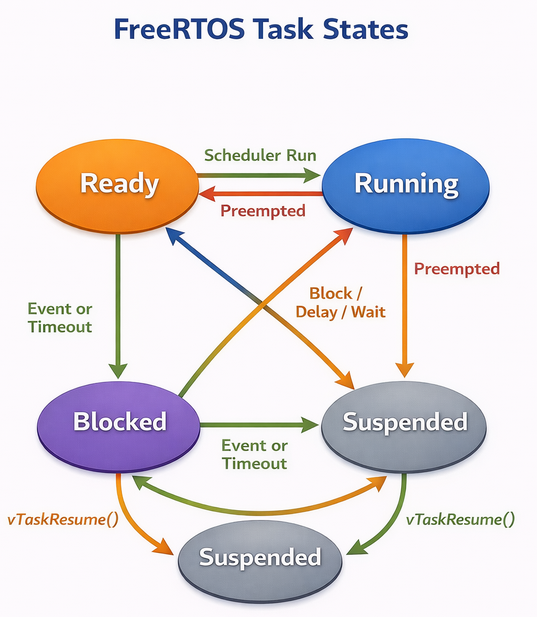

# Task Creation and Management in FreeRTOS

## Overview

Task management is the cornerstone of FreeRTOS functionality. Unlike traditional bare-metal programming where a single main loop runs continuously, FreeRTOS allows you to break your application into multiple independent tasks, each with its own execution context, priority, and lifecycle.

## Task Creation with xTaskCreate()

The `xTaskCreate()` function is the primary method for creating tasks in FreeRTOS. It dynamically allocates memory for the task's stack and Task Control Block (TCB).

**Function Signature:**
```c
BaseType_t xTaskCreate(
    TaskFunction_t pvTaskCode,      // Pointer to task function
    const char * const pcName,      // Descriptive name for debugging
    uint16_t usStackDepth,          // Stack size in words (not bytes!)
    void *pvParameters,             // Parameters passed to task
    UBaseType_t uxPriority,         // Task priority
    TaskHandle_t *pxCreatedTask     // Handle to created task (optional)
);
```

**Return Value:** `pdPASS` if task created successfully, `errCOULD_NOT_ALLOCATE_REQUIRED_MEMORY` if insufficient heap memory.

### Practical Example: LED Blink Tasks

```c
#include "FreeRTOS.h"
#include "task.h"

// Task function for blinking LED1
void vLED1Task(void *pvParameters)
{
    uint32_t delayTime = *(uint32_t *)pvParameters;
    
    for(;;)  // Tasks must never return
    {
        GPIO_TogglePin(LED1_PORT, LED1_PIN);
        vTaskDelay(pdMS_TO_TICKS(delayTime));  // Delay in milliseconds
    }
}

// Task function for blinking LED2
void vLED2Task(void *pvParameters)
{
    for(;;)
    {
        GPIO_TogglePin(LED2_PORT, LED2_PIN);
        vTaskDelay(pdMS_TO_TICKS(500));
    }
}

int main(void)
{
    // Hardware initialization
    HAL_Init();
    SystemClock_Config();
    GPIO_Init();
    
    uint32_t led1Delay = 1000;  // 1 second delay
    TaskHandle_t xLED1Handle = NULL;
    
    // Create first task with parameter
    xTaskCreate(
        vLED1Task,              // Task function
        "LED1_Blink",           // Name for debugging
        128,                    // Stack size (128 words = 512 bytes on 32-bit)
        (void *)&led1Delay,     // Pass delay as parameter
        1,                      // Priority (1 = low)
        &xLED1Handle            // Store task handle
    );
    
    // Create second task without storing handle
    xTaskCreate(
        vLED2Task,
        "LED2_Blink",
        128,
        NULL,                   // No parameters
        1,                      // Same priority
        NULL                    // Don't need handle
    );
    
    // Start the scheduler
    vTaskStartScheduler();
    
    // Should never reach here
    for(;;);
}
```

## Task Control Block (TCB)

Every task has an associated TCB that stores all information needed to manage the task. The TCB is a private structure containing:

- **Stack pointer**: Current top of the task's stack
- **Task state**: Running, Ready, Blocked, or Suspended
- **Priority**: Task's execution priority (0 = lowest)
- **Task name**: Human-readable identifier
- **Stack base address**: For stack overflow detection
- **Event list pointers**: For synchronization objects (queues, semaphores)
- **Notification state**: For direct-to-task notifications
- **Time slice counter**: For round-robin scheduling

You don't access the TCB directly; instead, you use a `TaskHandle_t` (an opaque pointer) to reference tasks in API calls.

## Task States

Tasks in FreeRTOS transition between four states:

### 1. Running State
Only one task per core can be in the Running state at any time. This is the task currently executing on the CPU.

### 2. Ready State
Tasks that are able to run but aren't currently executing because a higher-priority task is running. Ready tasks are organized in priority-ordered lists.

### 3. Blocked State
Tasks waiting for an event (timeout, semaphore, queue data, etc.). Blocked tasks don't consume CPU time and aren't considered for scheduling.

**Common blocking operations:**
- `vTaskDelay()` - Block for a specific time
- `xQueueReceive()` - Block waiting for queue data
- `xSemaphoreTake()` - Block waiting for semaphore
- `ulTaskNotifyTake()` - Block waiting for notification

### 4. Suspended State
Tasks explicitly suspended by `vTaskSuspend()`. They remain suspended until explicitly resumed with `vTaskResume()`. Unlike blocked tasks, suspended tasks won't automatically transition to Ready.



### State Transition Example

```c
TaskHandle_t xDataProcessingHandle = NULL;

void vDataProcessingTask(void *pvParameters)
{
    uint32_t notificationValue;
    
    for(;;)
    {
        // BLOCKED: Wait for notification from ISR
        notificationValue = ulTaskNotifyTake(
            pdTRUE,           // Clear notification on exit
            portMAX_DELAY    // Wait indefinitely
        );
        // Transitions to READY when notification received
        // Scheduler moves to RUNNING when highest priority
        
        // Process data
        ProcessSensorData();
        
        // BLOCKED: Delay for 100ms
        vTaskDelay(pdMS_TO_TICKS(100));
        // Transitions to READY after timeout expires
    }
}

void EXTI_IRQHandler(void)
{
    BaseType_t xHigherPriorityTaskWoken = pdFALSE;
    
    // Send notification to task (moves from BLOCKED to READY)
    vTaskNotifyGiveFromISR(xDataProcessingHandle, &xHigherPriorityTaskWoken);
    
    portYIELD_FROM_ISR(xHigherPriorityTaskWoken);
}
```

This FreeRTOS code demonstrates **interrupt-to-task communication** using the efficient task notification mechanism.

#### Task Handle and Setup

The `TaskHandle_t xDataProcessingHandle` is a global handle that stores a reference to the data processing task. This handle is essential because the interrupt service routine (ISR) needs it to send notifications to the task.

#### The Data Processing Task

The `vDataProcessingTask` function runs in an infinite loop and follows this flow:

**Waiting for Notification**: The task calls `ulTaskNotifyTake()` which blocks the task until it receives a notification. The parameters mean:
- `pdTRUE` clears the notification counter after reading it (binary semaphore behavior)
- `portMAX_DELAY` makes the task wait indefinitely until a notification arrives

While waiting, the task enters the **BLOCKED** state and doesn't consume any CPU time. When the ISR sends a notification, the task transitions to the **READY** state. The scheduler then moves it to **RUNNING** when it becomes the highest priority ready task.

**Processing Data**: Once unblocked, the task calls `ProcessSensorData()` to handle whatever sensor data triggered the interrupt. This is where the actual work happens.

**Delay Period**: After processing, `vTaskDelay(pdMS_TO_TICKS(100))` blocks the task for 100 milliseconds. This converts milliseconds to system ticks and suspends the task. The task moves to **BLOCKED** state again, then back to **READY** after the timeout expires, and finally returns to the top of the loop to wait for the next notification.

#### The Interrupt Handler

The `EXTI_IRQHandler` is an external interrupt handler (like from a GPIO pin or sensor). Here's what happens:

**Task Woken Flag**: `xHigherPriorityTaskWoken` starts as `pdFALSE` and tracks whether the notification wakes up a higher-priority task than what's currently running.

**Sending Notification**: `vTaskNotifyGiveFromISR()` increments the notification value for the data processing task. 
The `FromISR` suffix indicates this is the interrupt-safe version. This call immediately moves the task from **BLOCKED** to **READY** state.

**Context Switch**: `portYIELD_FROM_ISR(xHigherPriorityTaskWoken)` checks if a higher priority task was woken. If so, it triggers a context switch immediately after exiting the ISR, ensuring the newly-ready task runs as soon as possible rather than waiting for the next scheduler tick.

#### Key Benefits

This pattern is very efficient because task notifications are lighter weight than semaphores or queues, requiring no separate kernel objects. The task only wakes when there's actual work to do, and the 100ms delay prevents the task from spinning if interrupts arrive rapidly. The context switch mechanism ensures responsive real-time behavior by running high-priority tasks immediately after ISR completion.


## Task Lifecycle and Deletion

### Creating Tasks at Runtime

Tasks can create other tasks dynamically:

```c
void vManagerTask(void *pvParameters)
{
    TaskHandle_t xWorkerHandle;
    
    for(;;)
    {
        if(workloadIncreased())
        {
            // Create additional worker task
            xTaskCreate(
                vWorkerTask,
                "Worker",
                256,
                NULL,
                2,
                &xWorkerHandle
            );
        }
        
        vTaskDelay(pdMS_TO_TICKS(1000));
    }
}
```

### Task Deletion with vTaskDelete()

Tasks can delete themselves or other tasks. When a task is deleted, its TCB and stack memory are freed by the Idle task.

**Function Signature:**
```c
void vTaskDelete(TaskHandle_t xTask);
```

**Important Notes:**
- Pass `NULL` to delete the calling task (self-deletion)
- Pass a valid `TaskHandle_t` to delete another task
- Memory is freed during Idle task execution, so the Idle task must be allowed to run
- Deleting tasks doesn't free resources they've allocated (mutexes, queues, etc.)

### Complete Lifecycle Example

```c
TaskHandle_t xTemporaryTaskHandle = NULL;

void vTemporaryTask(void *pvParameters)
{
    uint32_t workCount = 0;
    
    // Task runs for a limited time
    while(workCount < 100)
    {
        PerformWork();
        workCount++;
        vTaskDelay(pdMS_TO_TICKS(10));
    }
    
    // Self-deletion when work is complete
    vTaskDelete(NULL);  // Task ends here
}

void vControlTask(void *pvParameters)
{
    for(;;)
    {
        if(needsProcessing() && xTemporaryTaskHandle == NULL)
        {
            // Create temporary worker
            xTaskCreate(
                vTemporaryTask,
                "TempWorker",
                256,
                NULL,
                2,
                &xTemporaryTaskHandle
            );
        }
        
        // Check if temporary task still exists
        if(xTemporaryTaskHandle != NULL)
        {
            if(eTaskGetState(xTemporaryTaskHandle) == eDeleted)
            {
                xTemporaryTaskHandle = NULL;  // Task has been deleted
            }
        }
        
        vTaskDelay(pdMS_TO_TICKS(500));
    }
}
```

## Task Suspension and Resumption

Sometimes you need to pause a task without deleting it:

```c
TaskHandle_t xLowPriorityTaskHandle;

void vPowerManagementTask(void *pvParameters)
{
    for(;;)
    {
        if(BatteryLevel() < 20)
        {
            // Enter power saving mode - suspend non-critical tasks
            vTaskSuspend(xLowPriorityTaskHandle);
        }
        else if(BatteryLevel() > 50)
        {
            // Resume normal operation
            vTaskResume(xLowPriorityTaskHandle);
        }
        
        vTaskDelay(pdMS_TO_TICKS(5000));
    }
}
```

## Priority Management Example

```c
void vDynamicPriorityTask(void *pvParameters)
{
    UBaseType_t uxOriginalPriority = uxTaskPriorityGet(NULL);
    
    for(;;)
    {
        // Normal priority operation
        PerformRegularWork();
        
        if(CriticalEventDetected())
        {
            // Temporarily boost priority
            vTaskPrioritySet(NULL, configMAX_PRIORITIES - 1);
            
            HandleCriticalEvent();
            
            // Restore original priority
            vTaskPrioritySet(NULL, uxOriginalPriority);
        }
        
        vTaskDelay(pdMS_TO_TICKS(100));
    }
}
```

## Best Practices

**Stack Sizing:** Start with generous stack sizes and use `uxTaskGetStackHighWaterMark()` to measure actual usage. Stack overflow is a common issue.

**Task Structure:** Tasks should have an infinite loop and never return. Use `vTaskDelay()` to yield CPU time to other tasks.

**Idle Task:** Never block the Idle task for extended periods—it's responsible for cleaning up deleted tasks and may run power-saving hooks.

**Priority Inversion:** Be aware that lower-priority tasks holding resources can block higher-priority tasks. Use priority inheritance mutexes to mitigate this.

**Resource Cleanup:** Before deleting tasks, ensure they release all acquired resources (semaphores, mutexes, dynamically allocated memory).

This foundation of task management enables you to build complex, responsive embedded systems where multiple concurrent activities are managed efficiently by the FreeRTOS scheduler.