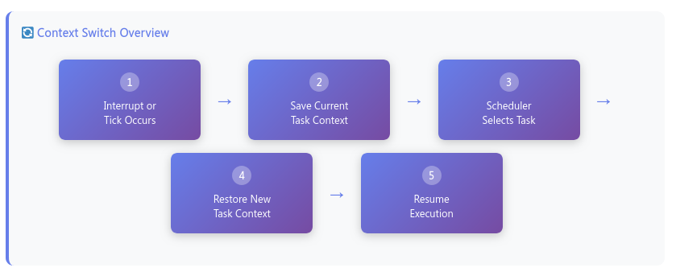
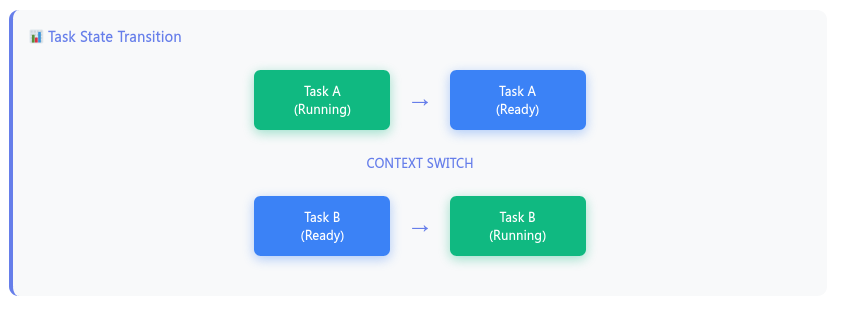
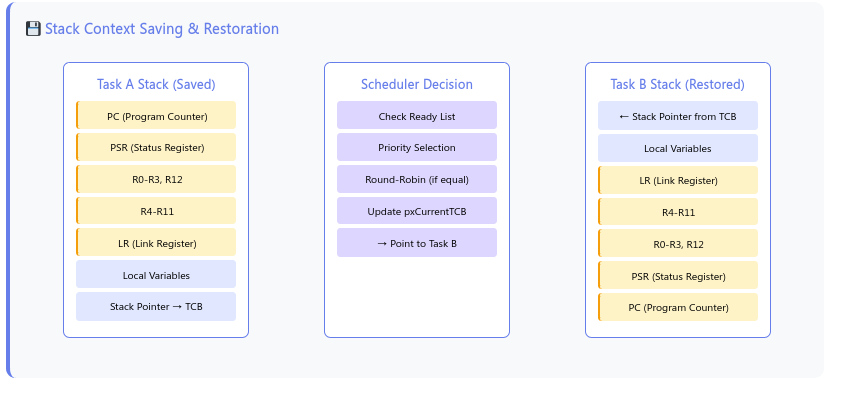
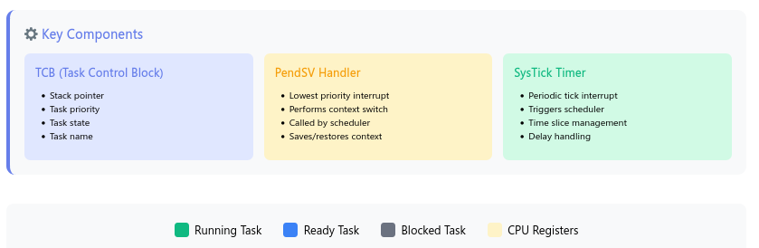

# FreeRTOS task context switch process 

**The Five-Step Process:**
1. **Interrupt/Tick** - SysTick timer or another interrupt triggers the switch
2. **Save Context** - Current task's CPU registers and state are saved to its stack
3. **Scheduler** - Selects the highest priority ready task
4. **Restore Context** - New task's registers are restored from its stack
5. **Resume** - Execution continues from where the new task left off

**Key Details Shown:**
- **Stack Operations**: How CPU registers (PC, PSR, R0-R12, LR) are pushed/popped
- **TCB Role**: Task Control Block maintains the stack pointer and task state
- **PendSV Handler**: The lowest-priority interrupt that performs the actual context switch
- **Task States**: Transitions between Running, Ready, and Blocked states

The context switch is fundamental to FreeRTOS's ability to provide multitasking on a single CPU core. It happens extremely quickly (microseconds) and is completely transparent to the running tasks.

